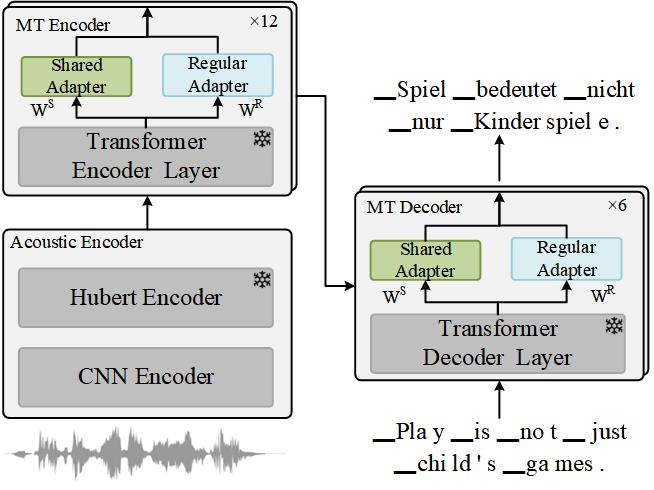
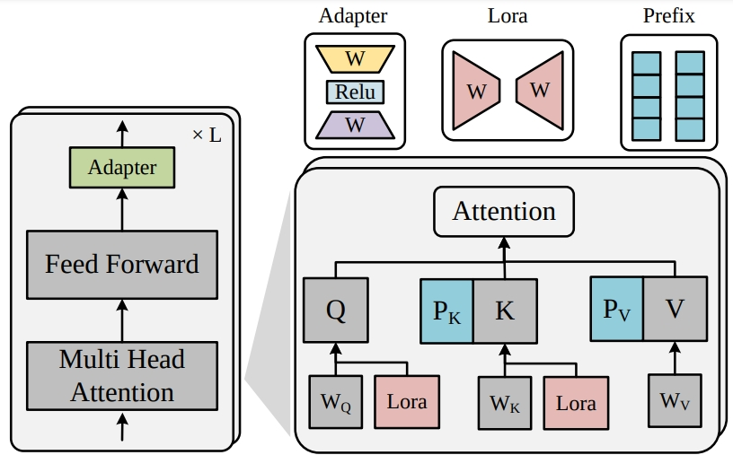
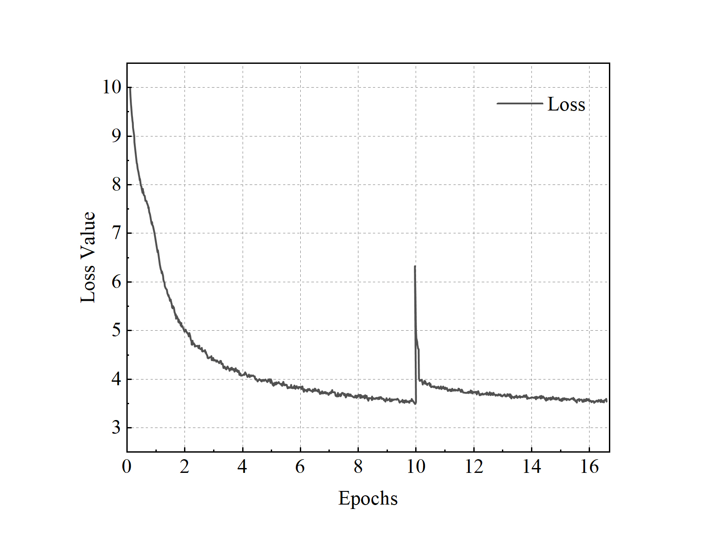

<h2 align="center">
Parameter-Efficient Adapters Based on Pre-trained Models for Speech Translation
</h2>

<p align="center">
  <!--  -->
  <!-- <under review></a> -->
  
  
</p>

<p align="center">
Codes for our regular and share adapters for speech-to-text translation tasks (Under review).
After the review period, we will open-source the code on our GitHub.
</p>

### Overview

<div style="text-align: center">

</div>


### PEFT methods

<div style="text-align: center">

</div>
<!--  -->


### Loss Curve of NAS
<div style="text-align: center">

</div>


### Installation

1. Create a conda environment with Pytorch:

```
conda create --name adapters python=3.9
conda activate adapters
```

2. Install fairseq

```bash
git clone https://github.com/pytorch/fairseq
cd fairseq
pip install --editable ./

# Next: Important!
python setup.py build develop
```

3. Other operations

    *Notes: Due to the version compatibility of packages, you also need to reinstall the following packages：*

```bash
# numpy np.float error 
pip install numpy==1.23.5

# generation error: sacrebleu import error TOKENIZER 
pip install sacrebleu==1.5.1
```

This repository is constructed using the codebase from fairseq. If you require information on the basic usage of fairseq, please refer to the [fairseq documentation](https://fairseq.readthedocs.io/en/latest/).

4. Other requirements

- pandas==2.0.3
- sacrebleu==1.5.1
- scikit-learn==1.3.0
- scipy==1.11.1
- sentencepiece==0.1.99
- tensorboard==2.14.0
- torch==2.0.1
- torchaudio==2.0.2
- tqdm==4.65.0


### Datasets and Models


<!-- #### Mustc v1 -->
#### MuST-C Datasets Prepare

1. Please Download [MuSTc-v1](https://docs.google.com/forms/d/e/1FAIpQLSer9jNfUtxbi610n3T6diXRlANBbuzShsCje-GtKs1Sngh0YQ/viewform?pli=1) datasets. 

   *Notes: It appears that the original dataset [website](https://www.fbk.eu/en/research-centers/) hides the download link. However, the dataset can still be downloaded after filling out the dataset request [form](https://docs.google.com/forms/d/e/1FAIpQLSer9jNfUtxbi610n3T6diXRlANBbuzShsCje-GtKs1Sngh0YQ/viewform?pli=1) directly. So we recommend that you use this method.*

2. Make directories to store ST (MuST-C) and datasets. Please specify the target language.

```
TARGET=de
MUSTC_ROOT=data/mustc
```

3. Unzip the mustc datasets.
```
cd $MUSTC_ROOT
tar -xzvf MUSTC_v1.0_en-${TARGET}.tar.gz
```

#### Deltalm Prepare
1.  Download [Vocabulary](https://deltalm.blob.core.windows.net/deltalm/dict.txt), [ Sentencepiece-model](https://deltalm.blob.core.windows.net/deltalm/spm.model) and [Model](https://deltalm.blob.core.windows.net/deltalm/deltalm-base.pt) of deltalm and you need to tokenize raw data to spm data. 

2.  Preprocess spm data. 

#### Speech Pre-trained Model 

1. We use Hubert model for speech pre-trained model for training. Before training, please download the [HuBERT-Base](https://dl.fbaipublicfiles.com/hubert/hubert_base_ls960.pt) model.


### Training
#### Machine Translation Pre-train
*Notes: We first pre-train machine translation model with transcribed speech data (text) and target text data to initialize the speech-to-text model parameters (except for the Hubert model). Besides, to ensure a fair comparison with other baseline models, we did not employ the multilingual machine translation settings during the training phase.*
```
DATA_BIN=/workspace/s2t/mustc/en-de/binary
SAVE_DIR=/path/to/save
USER_DIR=/path/to/deltalm # deltalm dir
PRETRAINED_MODEL=/workspace/deltalm/pretrain_model/deltalm-base.pt

export CUDA_VISIBLE_DEVICES=3
PRETRAINED_MODEL=/workspace/deltalm/pretrain_model/deltalm-base.pt
DATA_BIN=/workspace/s2t/mustc/en-de/delta_data_bin


python train.py $DATA_BIN \
    --arch deltalm_base \
    --user-dir $USER_DIR \
    --pretrained-deltalm-checkpoint $PRETRAINED_MODEL \
    --share-all-embeddings \
    --max-source-positions 512 --max-target-positions 512 \
    --criterion label_smoothed_cross_entropy \
    --label-smoothing 0.1 \
    --optimizer adam --adam-betas '(0.9, 0.98)' \
    --lr-scheduler inverse_sqrt \
    --lr 8e-5 \
    --warmup-init-lr 1e-07 \
    --stop-min-lr 1e-09 \
    --warmup-updates 6000 \
    --max-update 400000 \
    --max-epoch 50 \
    --max-tokens 8192 \
    --update-freq 1 \
    --seed 1 \
    --tensorboard-logdir $SAVE_DIR/tensorboard \
    --save-dir $SAVE_DIR/checkpoints \
    --keep-last-epochs 50 --fp16
```


#### Speech-to-text Translation Training
##### Normal Adapter
```
target=it
cd /workspace/projects/s2t/data/en-$target
export CUDA_VISIBLE_DEVICES=0
target=it


pretrain_checkpoints_num=10

data_dir=/workspace/projects/s2t/data/en-$target
TEXT_DIR=/workspace/projects/s2t/deltalm_data/en-$target/binary

USER_DIR=/workspace/projects/s2t/cress_adapter
HU_BERT=/workspace/projects/s2t/cress/hubert
ARCH=deltalm_transformer_adapter_emd

adapters_bottle_num=128
SAVE_DIR=/workspace/projects/s2t/save_dir/$target/st_deltalm_adapters_emd_$adapters_bottle_num

fairseq-train $data_dir --text-data $TEXT_DIR --tgt-lang $target \
  --user-dir $USER_DIR \
  --config-yaml config.yaml --train-subset train --valid-subset dev \
  --save-dir $SAVE_DIR --num-workers 4 --max-tokens 3000000 --batch-size 32 --max-tokens-text 4096 --max-update 100000 \
  --task speech_and_text_translation --criterion speech_and_text_translation --label-smoothing 0.1 \
  --arch $ARCH --optimizer adam --adam-betas '(0.9, 0.98)' --lr 1e-4 --lr-scheduler inverse_sqrt --weight-decay 0.0001 \
  --ddp-backend=legacy_ddp \
  --warmup-updates 4000 --clip-norm 0.0 --seed 1 --update-freq 2 \
  --patience 10 \
  --fp16 \
  --st-training --mt-finetune \
  --hubert-model-path $HU_BERT/hubert_base_ls960.pt \
  --pretrained_deltalm_checkpoint /workspace/projects/s2t/save/$target/checkpoints/checkpoint$pretrain_checkpoints_num.pt \
  --max-source-positions 512 --max-target-positions 512  --adapters-bottle $adapters_bottle_num --tensorboard-logdir $SAVE_DIR
```

##### Share Adapter
```
# change USER_DIR
USER_DIR=/workspace/projects/s2t/cress_adapter_share
# change --arch
--arch deltalm_transformer_adapter_emd_share
```

##### Adapter NAS
```
# change USER_DIR
USER_DIR=/workspace/projects/s2t/cress_adapter_share_nas
# change --arch
--arch deltalm_transformer_adapter_emd_share_nas
```

#### Prefix (referring to [Prefix-v2](https://github.com/THUDM/P-tuning-v2))

```
# change --user-dir 
USER_DIR=/workspace/projects/s2t/cress_prefix
# change --arch
--arch deltalm_transformer_prefix
# remove --adapters-bottle
## add --prefix_length NUM
```

#### Lora (referring to [Lora](https://github.com/microsoft/LoRA))

```
# pip install loralib
# change --user-dir 
USER_DIR=/workspace/projects/s2t/cress_lora
--arch deltalm_transformer_adapter_emd_share_lora
# remove --adapters-bottle
# change Lora hyper-parameter --lora_r NUM

```

### Evaluation
```
export CUDA_VISIBLE_DEVICES=3
DATA_BIN=/workspace/s2t/mustc/en-de/delta_data_bin

SAVE_DIR=/workspace/deltalm/save_dir/delta_s2t_ted_en_de_right/checkpoints/checkpoint5.pt
python generate.py $DATA_BIN \
    --user-dir $USER_DIR \
    --path $SAVE_DIR \
    --batch-size 128 --beam 5 --remove-bpe=sentencepiece
```

It should be noted that for the sake of reproducibility of our method, we do not use the [average model parameter trick](https://github.com/facebookresearch/fairseq/blob/main/scripts/average_checkpoints.py) often used in other papers.


### Acknowledgment

We refer to the code of [Deltalm](https://github.com/microsoft/unilm/tree/master/deltalm),  [Lora](https://github.com/microsoft/LoRA) and [Prefix-v2](https://github.com/THUDM/P-tuning-v2). Thanks for their great contributions!
